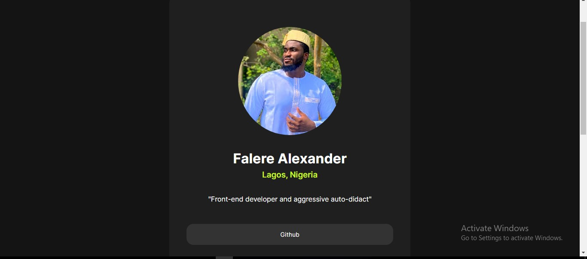
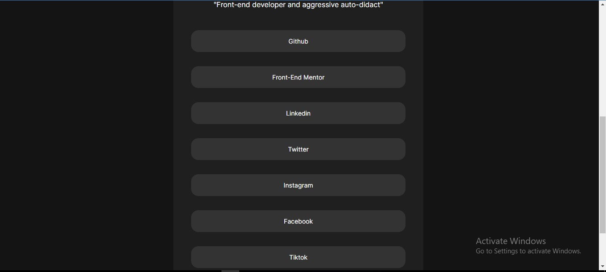

# Frontend Mentor - Social links profile solution

This is a solution to the [Social links profile challenge on Frontend Mentor](https://www.frontendmentor.io/challenges/social-links-profile-UG32l9m6dQ). Frontend Mentor challenges help you improve your coding skills by building realistic projects. 

## Table of contents

- [Overview](#overview)
  - [The challenge](#the-challenge)
  - [Screenshot](#screenshot)
  - [Links](#links)
- [My process](#my-process)
  - [Built with](#built-with)
  - [What I learned](#what-i-learned)
  - [Continued development](#continued-development)
  - [Useful resources](#useful-resources)
- [Author](#author)
- [Acknowledgments](#acknowledgments)

## Overview

The project involves building a social media link tree that allows visitors to access a persons social media links. It is a single webpage.

### The challenge

Users should be able to:

- See hover and focus states for all interactive elements on the page

### Screenshot




### Links

- Solution URL: [https://github.com/Alexanderlucid/socialmedialinks_webpage](https://github.com/Alexanderlucid/socialmedialinks_webpage)
- Live Site URL: [https://alexandersocials.netlify.app](https://mysocials.netlify.app/)

## My process
- Desktop-first workflow
- Built out html first
- styled top to bottom with css
- Finished off with mobile responsiveness

### Built with

- Semantic HTML5 markup
- CSS custom properties
- Flexbox

### What I learned
I struggled so much with controlling the height of the html body, and this was because i kept applying flexbox to the body but I was not getting the effect for ``flex-direction:column;`` ``justify-content:center;`` and this was happending because i had not declared a height on the body tha didn't allow the excess space be shared along the main-axis (Vertical-Axis) because there is actually no excess height space to be shared since the body has a height:auto; which means that the body only takes up a height that is necessary to contain it's child elements (This is what i did not know). An epiphany for me is that the best way to handle the height of the body is to first build out the project with html and css included and then afterwards adjust the height as needed, because most of the time, the project would fill out the body in such a way that adjusting the height might not completely be a necessity.

```css
body{
    width: 100%;
    background-color: var(--offblack-color);
    position: relative;
    font-family: 'inter', sans-serif;
}
.flex-alignment{
    display: flex;
    flex-direction: column;
    justify-content: center;
    align-items: center;
}
```
### Continued development

- I feel making use of css grid would have been more effective and so there would be a need for me to refine my knowledge of css grids and apply it more to my projects.

- I definitely will be building out more front-end mentor projects because it forces me to actively recall concepts and i get better understanding of various concepts.

### Useful resources

- [Are you making these heigh mistakes - Web dev simplified : youtube](https://www.youtube.com/watch?v=-sF5KsEo6gM&t=2s&pp=ygUZd2ViIGRldiBzaW1wbGlmaWVkIGhlaWdodA%3D%3D) -  This helped me learn about controlling the height on the body.
- [Various youtube videos on how to center a div on the body](https://www.youtube.com/shorts/xhMlF5VFdoA, https://www.youtube.com/shorts/P7tKk6vqgIo, https://www.youtube.com/shorts/-2CnrBUfAUQ, https://www.youtube.com/shorts/29QqzxK_9o0, https://www.youtube.com/shorts/fy5m1XjskxE, ) - This is how i understood how to center a div on the body or in a flex container.

## Author

- Website - [Falere Alexander](https://alexandersocials.netlify.app)
- Frontend Mentor - [Alexanderlucid](https://www.frontendmentor.io/profile/Alexanderlucid)
- Twitter - [@Lucidcode28](https://twitter.com/LucidCode28)

## Acknowledgments

Massive kudos to the frontend-mentors organization for making this project available for me to be able to implement and sharpen my coding skills and coding intuition.
